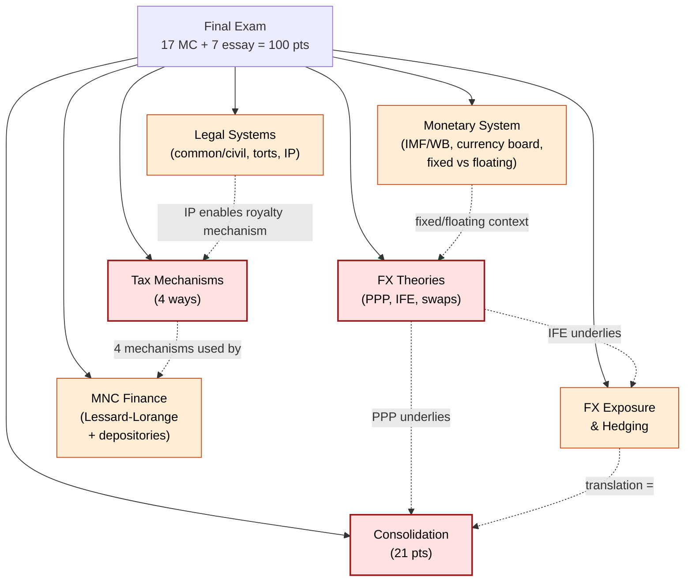
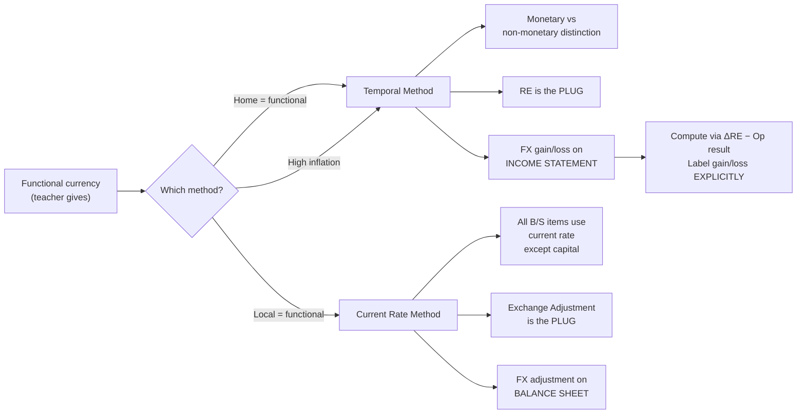
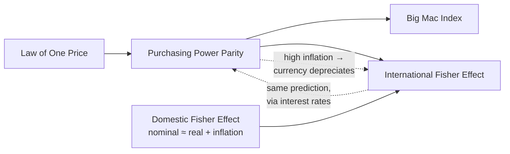
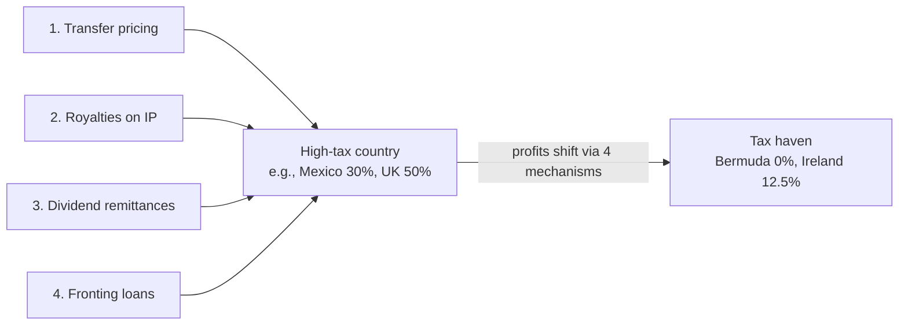
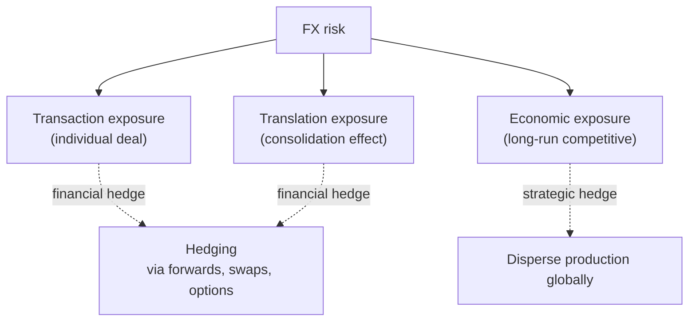
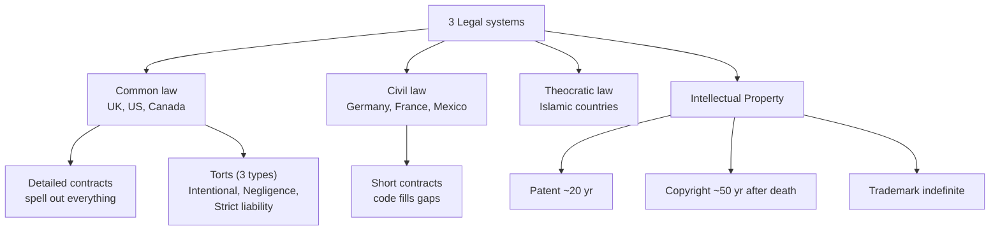

> Visual overview of the 7 topic clusters and how they connect. Click any cluster to drill in.

🟥 = guaranteed / very high probability    🟧 = high probability

## Within Consolidation

See [[topics/consolidation/index|Consolidation cluster]].

## Within FX Theories

See [[topics/fx-theories/index|FX Theories cluster]].

## Within Tax Mechanisms

See [[topics/tax-mechanisms/index|Tax Mechanisms cluster]].

## Within FX Exposure

See [[topics/fx-exposure/index|FX Exposure cluster]].

## Within Legal Systems

See [[topics/legal-systems/index|Legal Systems cluster]].
