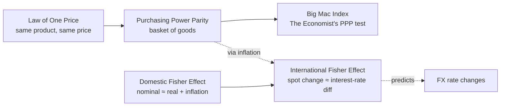

> Foundation of Chapter 10. Guaranteed multiple choice and at least one calculation question. The IFE formula is explicitly confirmed to appear on the exam.

## Pages in this cluster

| Page | What it covers |
|---|---|
| [[international-fisher-effect\|International Fisher Effect (IFE)]] | **Guaranteed exam question.** Formula + book error + worked examples |
| [[purchasing-power-parity\|Purchasing Power Parity & Big Mac Index]] | Over/undervaluation calculation; very likely on exam |
| [[law-of-one-price\|Law of One Price]] | The foundation PPP extends from |
| [[spot-forward-swap\|Spot, Forward, and Currency Swap]] | Definitions; **currency swap = "with 2 different value dates"** must-include |
| [[carry-trade\|Carry trade & exchange-rate forecasting]] | Brief — possible MC |

## Why this cluster matters

The teacher said the IFE will appear on the exam. PPP/Big Mac is also explicitly review-flagged. Plus "currency swap" definition is one the teacher said *"I'll probably put on the exam"* — and there's an exact phrase he listens for.

## Big picture relationships

> The same fundamental prediction comes out of both PPP and IFE: **higher inflation → currency depreciation**. Just expressed differently — PPP via goods prices, IFE via interest rates.

## Key facts the teacher highlighted

| Topic | What to remember |
|---|---|
| [[international-fisher-effect\|IFE]] | Formula is on the exam; book has S₂ in denominator — that's wrong, use **S₁** |
| [[purchasing-power-parity\|PPP / Big Mac]] | Compute theoretical rate, compare to actual, derive over/under valuation percent |
| [[spot-forward-swap\|Currency swap]] | Must include "with 2 different value dates" in the definition |
| [[law-of-one-price\|Law of one price ↔ PPP]] | Q20 directly asks how they're related |

## Exam questions where this cluster shows up

- [[../../questions/q03-ife-mxn-gbp|Q3 — IFE calculation (MXN/GBP)]]
- [[../../questions/q04-bigmac-mexico|Q4 — Big Mac Mexico]]
- [[../../questions/q05-chile-argentina-ppp-ife|Q5 — Chile/Argentina PPP + IFE]]
- [[../../questions/q06-peru-ife|Q6 — Peru IFE]]
- [[../../questions/q20-law-of-one-price-ppp|Q20 — Law of one price ↔ PPP]]
- Likely additional MC + 1 essay
