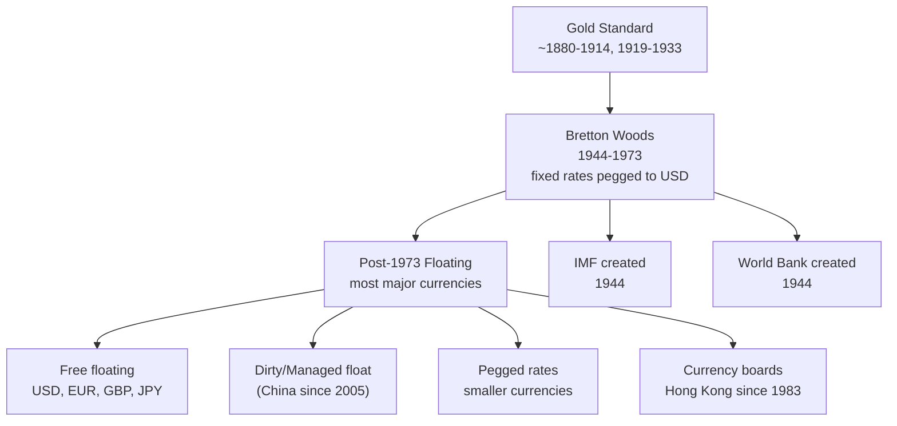

> Chapter 11. Multiple "must know" items per the teacher. Probably 3 multiple choice + 1 essay.

## Pages in this cluster

| Page | What it covers |
|---|---|
| [[gold-standard\|Gold standard]] | When it ended (3 dates: 1933/1971/1973) + how it worked |
| [[bretton-woods\|Bretton Woods system]] | 1944-1973 history + collapse |
| [[fixed-vs-floating\|Fixed vs floating exchange rates]] | Pros/cons of each — likely essay (Q11) |
| [[currency-board\|Currency board]] | **MUST include "100% reserves"**; Q9 essay |
| [[pegged-and-dirty-float\|Pegged rate & dirty float]] | Definitions |
| [[imf-vs-worldbank\|IMF vs World Bank]] | "Must know" — roles + examples |

## Why this cluster matters

Teacher's "must know" items from this chapter:

| Topic | Teacher signal |
|---|---|
| [[imf-vs-worldbank\|IMF vs World Bank]] | *"Must know"* |
| [[currency-board\|Currency board]] | *"100% reserves should be mentioned"* |
| [[gold-standard\|Gold standard]] | *"When did the gold standard cease?"* (review question) |
| [[fixed-vs-floating\|Fixed vs floating]] | *"Be prepared to talk about advantages and disadvantages"* |
| [[pegged-and-dirty-float\|Dirty float]] | *"What is a dirty float? Anybody know?"* (review question) |

## Big picture

## Exam questions where this cluster shows up

- [[../../questions/q09-currency-board|Q9 — Currency board purpose]]
- [[../../questions/q11-floating-vs-fixed|Q11 — Floating vs fixed]]
- [[../../questions/q-imf-vs-worldbank|Q — IMF vs World Bank]] (very likely)
- [[../../questions/q-gold-standard|Q — When did the gold standard cease?]]
- [[../../questions/q-dirty-float|Q — Dirty float definition]]
