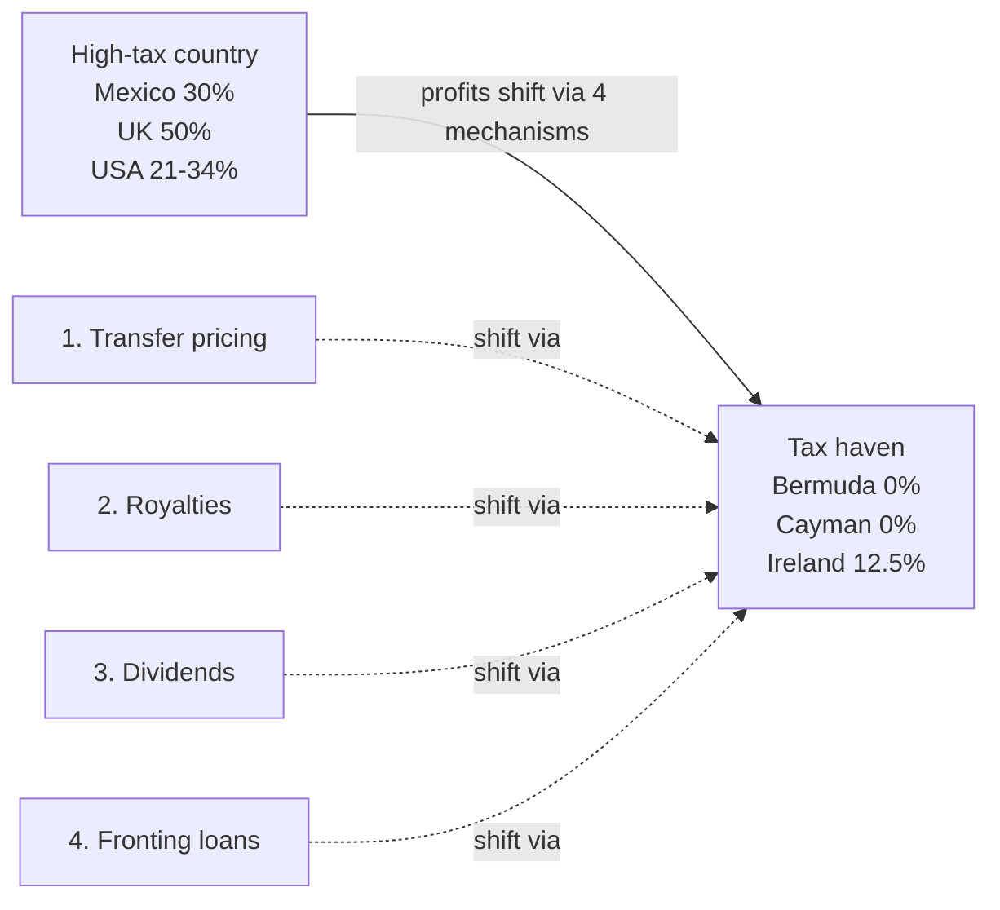

> The teacher said multiple times this WILL be on the exam. **Q10/Q19 are the same essay** in slightly different wording. Be able to explain all 4 mechanisms **in great detail** with examples.

## The 4 mechanisms (memorize order + names)

| # | Mechanism | One-line summary |
|---|---|---|
| 1 | [[transfer-pricing\|Transfer pricing]] | Manipulate inter-subsidiary prices to shift profits |
| 2 | [[royalties\|Charging royalties on IP]] | IP in low-tax sub; charge other subs royalties |
| 3 | [[dividends\|Charging dividend remittances]] | High-tax sub pays dividends to tax-haven owner |
| 4 | [[fronting-loans\|Fronting loans]] | Channel funds via international bank between tax haven and high-tax sub |

All four exploit **[[tax-havens|tax havens]]** (countries with very low or zero corporate income tax).

## Why this cluster matters

- Q10: *"What actions can a firm take to minimize its global tax liability? On ethical grounds, can such actions be justified?"*
- Q19: Same question, slight variation
- Likely MC on transfer pricing direction (Q1)

The teacher said: *"This will be a question of the final exam — what are the 4 mechanisms?"*

## Pages in this cluster

| Page | What it covers |
|---|---|
| [[transfer-pricing\|Transfer pricing]] | Direction rule, worked examples, why governments dislike |
| [[royalties\|Royalties]] | IP-based mechanism + tax-deductibility advantage |
| [[dividends\|Dividend remittances]] | Most common mechanism; after-tax flow |
| [[fronting-loans\|Fronting loans]] | **Must know diagram**; teacher drew it twice |
| [[tax-havens\|Tax havens]] | Countries used; Apple/Microsoft real-world examples |
| [[ethics\|Ethics discussion]] | Pro/con argument for the essay |

## The big picture (diagram)

## Real-world examples

| Company | Mechanism |
|---|---|
| **Apple** | Double Irish / Dutch Sandwich — Apple Ireland (12.5%) → Apple Jersey (0%); \$252B+ accumulated offshore |
| **Microsoft Mexico → Ireland** | Royalties and dividends from Microsoft Mexico go to Microsoft Ireland (12.5% vs Mexico's 30%) |
| **Uber → Amsterdam** | Mexican Uber invoices show Amsterdam address — channeling profits to Netherlands |
| Other users | Nike, Starbucks, Amazon, Google |

## Q10/Q19 essay template (memorize structure)

**Answer:**

A multinational firm can reduce its global tax liability through four main mechanisms, all of which exploit **tax havens** (countries with very low or zero corporate income tax):

1. **[[transfer-pricing|Transfer pricing]]** — manipulating the prices at which subsidiaries of the same parent buy and sell from each other. High transfer prices on goods sold INTO a high-tax country raise that subsidiary's costs (lowering profit there); low transfer prices on goods sold OUT do the inverse. Profit shifts from high-tax to low-tax country.

2. **[[royalties|Charging royalties]]** on intellectual property — the IP is owned by a low-tax-country subsidiary. Other subsidiaries pay royalties for using patents, copyrights, trademarks. Royalty payments are typically tax-deductible locally, so they reduce the foreign sub's tax liability before any dividend.

3. **[[dividends|Charging dividends]]** — the high-tax-country subsidiary pays dividends to a parent or sister subsidiary in a tax haven. Most common mechanism. Dividends are paid AFTER local income tax, so this is less tax-efficient than royalties but still moves cash to a favorable jurisdiction.

4. **[[fronting-loans|Fronting loans]]** — a loan between two related subsidiaries channeled through an international bank. The tax-haven sub deposits cash with the bank → receives tax-free interest. The bank lends to the high-tax sub → interest paid is tax-deductible. The bank in the middle disguises the related-party nature of the loan, avoiding host-government scrutiny.

**Ethics:** the strategies are technically legal but morally questionable. Companies have a fiduciary duty to shareholders to minimize taxes within the law, but governments and the public increasingly view aggressive tax avoidance as unethical, especially when companies operate in countries where they don't pay their fair share of taxes. President Biden proposed a global minimum tax to harmonize rates (not approved). The EU is unhappy with Ireland's tax structure. Mexico's tax authority increasingly audits multinationals. See [[ethics|ethics page]] for full discussion.

See [[../../questions/q10-tax-mechanisms-ethics|Q10/Q19 page]].
